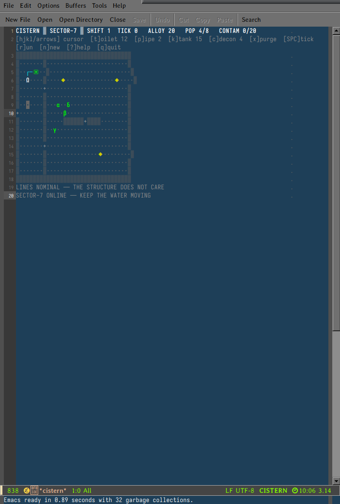

# CISTERN

**Sanitation management for the megastructure.** A turn-based infrastructure
sim for GNU Emacs, in the register of Tsutomu Nihei's *Blame!* — vast, silent,
ancient plumbing, and maintenance that nobody will ever thank you for.

You are not the creators. You are what keeps the creators alive: the toilets,
the pipe runs, the tanks, the decontamination crews. The structure does not
care what they become. Keep the water moving.



---

## Requirements

- GNU Emacs 27.1 or newer (tested on 31.1)
- A font with Greek and box-drawing glyphs (emacs defaults are fine)

No packages. No network. No timers. One file.

## Install

Drop `cistern.el` anywhere on your `load-path` and autoload the entry point:

```elisp
(add-to-list 'load-path (expand-file-name "lisp" user-emacs-directory))
(autoload #'cistern "~/.emacs.d/lisp/cistern.el" nil t)
```

Or just load it ad hoc:

```
emacs -l /path/to/cistern.el -f cistern
```

## Quick start

```
M-x cistern
```

`SPACE` advances one tick. That is the heartbeat of the whole game: nothing
happens unless you tick it forward.

## How it plays

Sector 7 is a carved slice of the megastructure: two chambers joined by doors,
three ore veins, one working toilet, one tank, and a short pipe run that some
long-dead crew left behind.

- **Creators** (α β γ δ …) work the ore veins. Every third tick on a vein
  yields **1 alloy**, your only currency.
- Their **bladders fill at 3%/tick**. At **70%** a creator stops working and
  walks to the nearest toilet that is (a) free, (b) wired by pipe to a tank,
  and (c) fed by a tank with headroom. Using a toilet takes **4 ticks**.
- At **100%** the creator breaches where they stand: the tile turns to
  **contaminant**, the sector count rises by 1, and every creator adjacent to
  the breach falls **sick** (they move every other tick and mine slower).
- Each toilet use sends **10 units of waste** down the line into the connected
  tank with the lowest load. A tank holds **60 units**. When no tank on a
  toilet's line has room for one more use, every toilet on that line is
  **backed up** — creators walk away and the clock keeps running.
- **Contaminant spreads**: each contaminated tile has a 6% chance per tick to
  poison one adjacent floor tile. It does not spread through walls. It does
  not spread through pipes. It does not care about you.
- Every **40 ticks a migrant arrives** at the west gate (population cap 8).
  Population means load. The pipes must grow.
- At **20 contamination** the sector is condemned. Your score is the shift
  you survived.

### The economy

| Action            | Cost      | Notes                                        |
|-------------------|-----------|----------------------------------------------|
| Build toilet      | 12 alloy  | Must stand on plain floor                    |
| Lay pipe          | 2 alloy   | Connects toilets to tanks                    |
| Build tank        | 15 alloy  | 60-unit capacity                             |
| Decontaminate     | 4 alloy   | Removes one contaminant tile                 |
| Purge tank        | free      | Empties a tank; **recovers 1 alloy per 3 units** |

Purging is the sink-and-faucet of the whole game: waste in, alloy back out.
A tank purged at 60 units returns 20 alloy — a third of a toilet-and-pipe
expansion, every cycle.

## Controls

| Key              | Action                          |
|------------------|---------------------------------|
| `SPC` / `RET`    | Advance one tick                |
| `h j k l` / arrows | Move the cursor               |
| `t`              | Build toilet (12)               |
| `p`              | Lay pipe (2)                    |
| `K`              | Build tank (15)                 |
| `c`              | Decontaminate tile (4)          |
| `x`              | Purge tank under cursor (free)  |
| `r`              | Run 10 ticks                    |
| `n`              | New game                        |
| `?`              | Briefing (in-game help)         |
| `q`              | Quit                            |

## Playing well

- **Purge before you must.** A backed-up line during a migrant wave is how
  sectors die. The yellow tank face at 50% is your real warning light.
- **Clogs are walls you paid for.** Nothing blocks a creator; everything
  blocks a line. Keep plumbing short.
- **Decontaminate early, not fully.** One tile left in a corner costs less
  than chasing a 6%-per-tick exponential through your work floor.
- **Sick creators still mine** — half speed. An accident next to a vein costs
  more than the 20% bladder you are racing.

## Verification

The file ships with a batch self-test covering map integrity, pipe
connectivity, tank back-up semantics, the purge economy, breach behavior,
pathing, and a 60-tick soak:

```
emacs --batch -l cistern.el -f cistern-run-selftest
```

Expected output: `CISTERN-SELFTEST-OK`

## Files

| File           | Purpose                                    |
|----------------|--------------------------------------------|
| `cistern.el`   | The entire game (state, sim, rendering)    |
| `README.md`    | This document                              |
| `DESIGN.md`    | Architecture and implementation notes      |
| `screenshot.png` | CISTERN mid-run in emacs 31.1            |

## License note

Shared as-is for Pat. Do what you want with it; the structure does not care.
