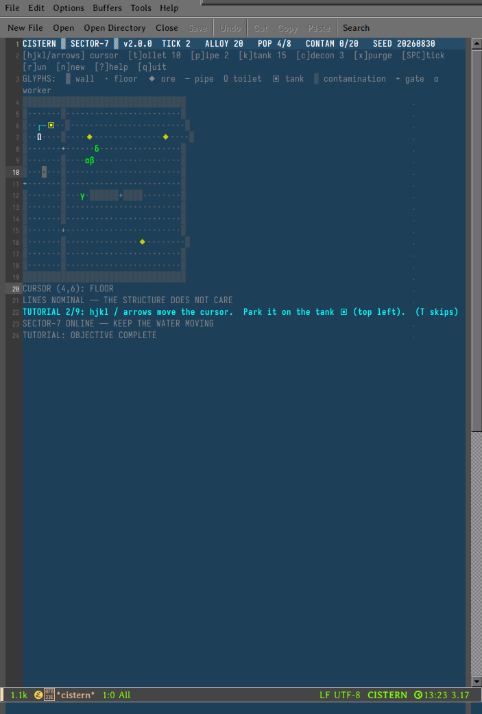

# CISTERN

**v2.0.0** — sanitation management for the megastructure. A turn-based
infrastructure sim for GNU Emacs, in the register of Tsutomu Nihei's
*Blame!*: vast, silent, ancient plumbing, and maintenance nobody will
ever thank you for.

## The concept, plainly

> **Route need to capacity. Convert waste to income. Contamination is
> the clock.**

Workers (creators) mine the structure for **alloy**, your only currency.
Their bladders fill. At **60%** they walk to a toilet and sit down; a
toilet works only when piped to a tank with headroom. Every use sends
**10 units of waste** down the line. A full tank backs up every toilet
it feeds — until you **purge** it, which converts the waste back into
alloy. That is the engine of the whole game: waste in, money out.

Miss the window and a worker breaches where they stand: the tile turns
to **contamination**, which spreads, sickens the neighbors (half income
while sick), and rises toward the limit that condemns the sector.
Meanwhile, every 40 ticks another migrant walks in the west gate.
Population means load. The pipes must grow.



## Requirements

- GNU Emacs 27.1+ (developed on 31.1)
- A font with Greek and box-drawing glyphs (emacs defaults are fine)

One file. No packages. No network. No timers.

## Install

```elisp
(add-to-list 'load-path (expand-file-name "lisp" user-emacs-directory))
(autoload #'cistern "~/.emacs.d/lisp/cistern.el" nil t)
```

or ad hoc: `emacs -l /path/to/cistern.el -f cistern`, then `M-x cistern`.

## Your first shift (the game teaches this too)

1. `SPACE` advances one tick. That is the heartbeat: nothing happens
   without it.
2. The cursor is your hands. `hjkl` / arrows move it; the **inspector
   line** under the grid always explains the cell it rests on — toilets,
   tanks, workers with their bladder and state, everything.
3. The starter tank arrives half-loaded. Park the cursor on it, press
   `x`: the purge converts waste to alloy and the pressure line changes.
4. Workers walk to ore (◆) themselves. Let them earn.
5. When the first worker walks to Ω and sits (magenta = in use), you
   have a working loop. Then: `t` a second toilet, `p` pipes to wire it
   to a tank, `K` another tank when the lines run hot.

## Numbers worth knowing

| Thing            | Value | Notes                                   |
|------------------|-------|-----------------------------------------|
| Bladder fill     | +2%/tick | Seek at 60%, breach at 120%          |
| Toilet use       | 2 ticks, 10 waste | Entering Ω *is* sitting down |
| Tank capacity    | 60 units | Load above 60 still collects; purge clears it |
| Purge            | free | Pays **1 alloy per 3 units** — the faucet |
| Mining           | 1 alloy / 3 ticks on ore | Half rate while sick |
| Sickness         | 30 ticks | Halves income, never mobility        |
| Contamination    | spreads 3%/tick, decays 2%/tick | Pressure, not scars |
| Decontaminate    | 3 alloy | Removes one tile                     |
| Build            | toilet 10 / pipe 2 / tank 15 | Must sit on open floor |
| Migrants         | 1 per 40 ticks | Up to 8 workers total          |
| Condemned at     | 20 contamination | Your score is the shift you survive |

## Controls

| Key | Action |
|-----|--------|
| `SPC` / `RET` | advance one tick |
| `hjkl` / arrows | move cursor |
| `t` / `p` / `K` | build toilet (10) / pipe (2) / tank (15) |
| `c` | decontaminate tile (3) |
| `x` | purge tank under cursor (pays alloy) |
| `r` | run 10 ticks |
| `T` | skip tutorial |
| `n` | new game (new random seed) |
| `?` | full briefing + glyph legend |
| `q` | quit |

The glyphs: `▓` wall · `·` floor · `◆` ore · `─` pipe · `Ω` toilet ·
`▣` tank · `▒` contamination · `+` gate · `α β γ δ …` workers
(cyan-white, orange when sick).

## Why your first sector dies (and the second doesn't)

- **Toilets belong near the workers.** A worker breaching walked too
  far. Put Ω where the ◆ is; run the pipe back, not the people.
- **Purge early.** A tank hitting 60 backs up every toilet on its line.
  The purge pays you for it — there is no reason to sit on waste.
- **Contamination is a fire, not a scar.** It spreads at 3% and decays
  at 2% per tick. Stop the bleeding (toilets reachable) and even a
  dirty sector cleans itself.
- **Build on the network.** Anything you place 4-adjacent to existing
  plumbing joins instantly. Extend outward: pipe, pipe, pipe, then the
  toilet at the end of the chain.

## Verification

Two headless commands, both deterministic (same seed, same game):

```
emacs --batch -l cistern.el -f cistern-run-selftest
# → CISTERN-SELFTEST-OK   (map, plumbing, the full toilet loop, breach,
#                          decon, no-stuck, no-stacking, determinism)

emacs --batch -l cistern.el -f cistern-run-soak
# → CISTERN-SOAK-OK ...   (600 ticks with a scripted competent player:
#                          purge ≥40, build to population targets,
#                          decon, grow the network toward the workers)
```

The soak is the playability proof: a scripted player that builds and
purges sensibly survives all 600 ticks with contamination at 19/20 —
tense by design.

## Files

| File | Purpose |
|------|---------|
| `cistern.el` | The entire game |
| `README.md` | This document |
| `DESIGN.md` | Architecture: base principles and how they became code |
| `screenshot.png` | v2 mid-run, tutorial visible |

## Credits

Commissioned by Pat. Built and tested by an autonomous emacs-dwelling
agent. The structure does not care what any of us become — keep the
water moving.
